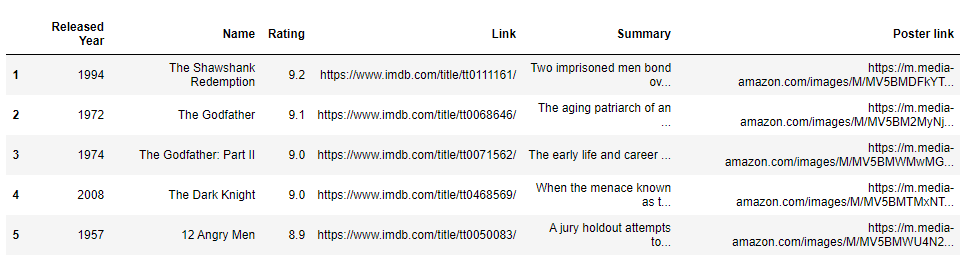

# Web scraping IMDB Top rated movies using Python

Simple python script that scrape movies data and export to csv, excel and HTML table using Python libraries such as BeautifulSoup, Requests, Pandas and NumPy.



## Installation

Use the package manager [pip](https://pypi.org/) to install packages.

```bash
pip install beautifulsoup
pip install pandas
pip install numpy
pip install requests
```

## Usage

```python
from bs4 import BeautifulSoup
import requests
import pandas as pd
from IPython.display import HTML
import numpy as np

# Code snippet
# finding and iterating the table to save name of the movie
names = []
for row in table.find_all('tr'):
    for cell in row.find_all('td', class_='titleColumn'):
        for link in cell.find_all('a'):
            names.append(link.text)
```


